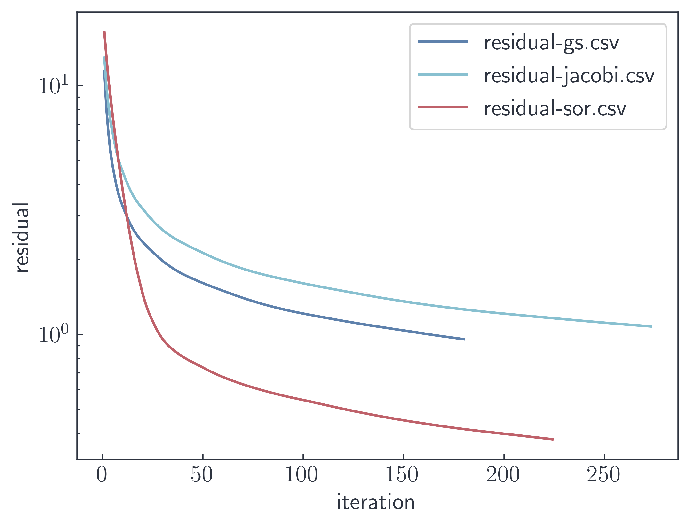

# `poisson`

An `mpi`-parallel poisson equation solver written in `C++`.

The poisson equation is solved on an `M*M*M` grid in a cubic domain with
periodic boundary conditions using a central difference scheme.

Parallel `hdf5` is used for i/o.

## Available solvers are:

- Jacobi
- Gauss-Seidel
- Successive over-relaxation (SOR)

    

## Dependencies

- `make`
- `mpi`
- `hdf5-mpi`

## TODO

- mpi virtual topologies with domain decomposition
- Implement ghost cells
- Overlap communication and computation
- Implement higher order central difference schemes
